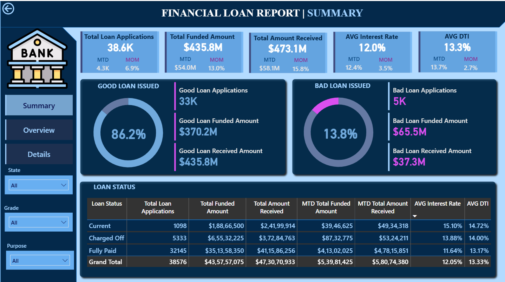
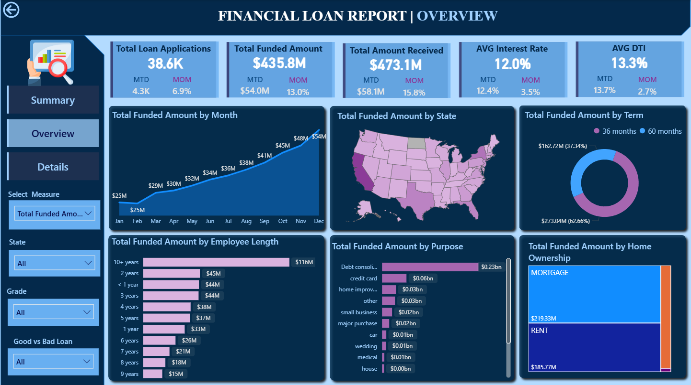
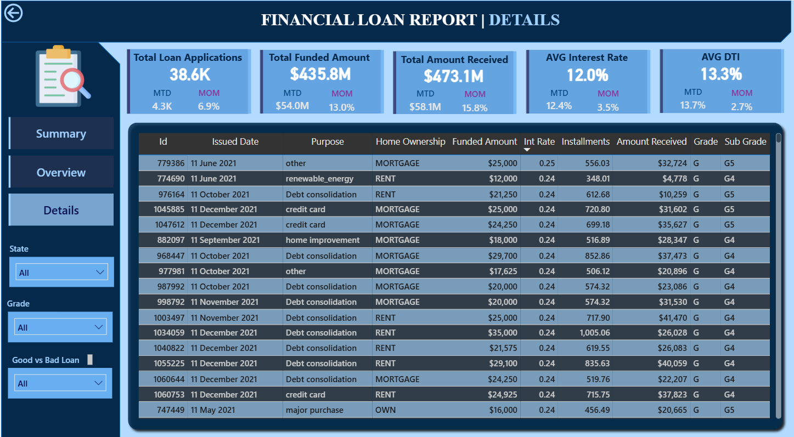

# Financial-Loan-Data-Analysis

This financial loan data analysis project was developed using MySQL for data cleaning and analytical processing, and Power BI for interactive dashboard development.
The dataset contained  ~38,000+ loan records, which were analyzed to understand borrower behavior, lending trends, and risk distribution.

The project delivered three fully designed dashboards, each presenting a unique perspective on loan performance and borrower characteristics. Key metrics such as Total Loan Applications, Total Funded Amount, Total Amount Received, and Loan Status were evaluated to support data-driven lending decisions.

## Dataset Summary

The Financial Loan Dataset contains 38,576 loan records with 24 key attributes capturing borrower details, loan characteristics, credit factors, and repayment information. This dataset is ideal for performing financial analysis, loan performance tracking, and risk assessment.

### Key Features Covered in the Dataset

-	Borrower Information:
address_state, grade, purpose 
-	Loan Details:
loan_amount, loan_status, int_rate, term 
-	Credit Profile:
emp_length, annual_income, total_acc, dti 
-	Financial Metrics:
total_payment, loan_amount, recoveries, installments

### Tech Stack Used:

Data cleaning – Microsoft Excel
Data analysis - MySQL
Dashboarding -PoweBI

### MySQL Workflow 
All core transformations and calculations were executed in MySQL, including:
-	Data type conversions (especially issue date)
-	Cleaning inconsistent text fields
-	Creating new calculated columns
-	Monthly & yearly aggregations
- Statewise and demographic grouping
-	Risk categorization for Good vs Bad loans

# 📊 Dashboard 1 — KPI Overview :

## Key Metrics Displayed
- Total Loan Applications
- Total Funded Amount
- Total Amount Received
- Average Interest Rate
- Average Debt-to-Income (DTI)
- Charts Included
- Loan Status Distribution
- Good Loan vs Bad Loan Segmentation
- Annual Income Category Summary
- Borrower Profile Indicators

# 📊 Dashboard 2 — KPI Overview :

This page focused on time-based trends and borrower demographic patterns.
Charts Included
- Monthly Trends by Issue Date (Line Chart) – Showed seasonality and long-term lending movement.
- State-Level Regional Map (Filled Map) – Highlighted states with the highest loan activity.
- Loan Term Distribution (Donut Chart) – Compared 36-month vs 60-month loans.
- Employment Length Analysis (Bar Chart) – Displayed how work experience impacted loan approvals.
- Loan Purpose Breakdown (Bar Chart) – Showed borrower intentions behind loan requests.
- Home Ownership Analysis (Tree Map) – Demonstrated how housing status influenced loan amounts and applications.
  
# 📊 Dashboard 2 — KPI Overview :

This dashboard provided an in-depth performance analysis of loan repayment and portfolio risk.
Charts Included
- Good Loan vs Bad Loan Metrics
- Loan Status KPIs
- Interest Rate vs Loan Grade Relationship
- Loan Amount vs Amount Received Comparison
- DTI Segmentation Visuals

## Key Insights

1. Borrowing Increased Over Time:
Monthly loan trends showed steady growth, indicating rising borrowing demand and seasonality patterns.

2. Certain States Dominated Loan Applications:
A limited number of states contributed the most applications, helping lenders focus on priority regions.

3. Employment Length Impacted Funding:
Borrowers with 5+ years of employment history showed higher approval and funding rates.

5. Debt Consolidation Was the Top Purpose:
This indicated rising financial pressure and dependency on credit restructuring.

7. Portfolio Was Mostly Stable:
A majority of loans fell under Fully Paid or Current, but Charged Off loans highlighted risk pockets that required attention

Together, the dashboards narrated a clear story:

Borrowers across the country showed strong repayment behavior, with most loans classified as good. However, specific states, loan purposes, and employment categories showed higher risk — highlighting where lenders should focus attention to strengthen performance.
